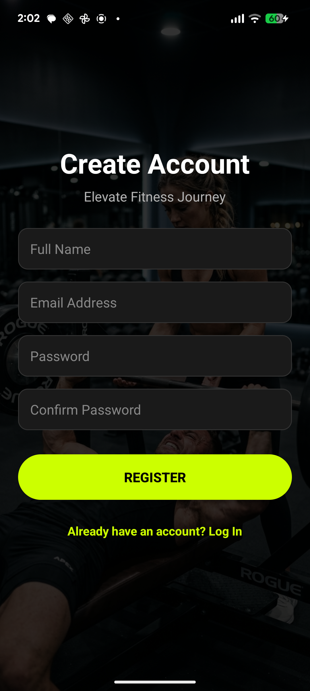
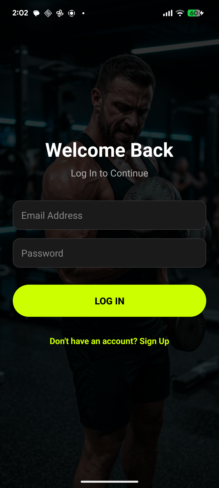
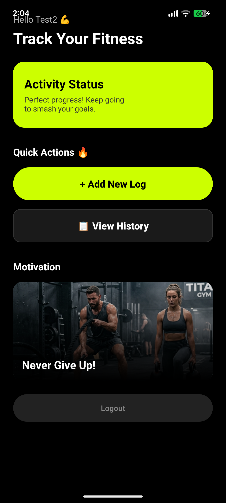
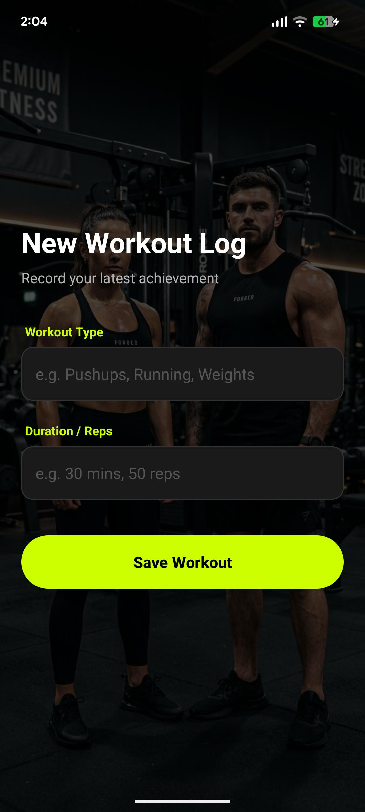
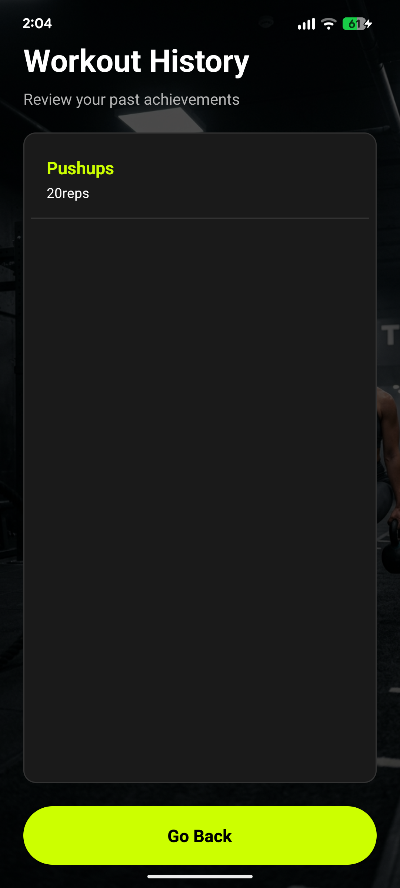

# Fitness Activity Log App 🔥

<p align="center">
  <b>Track Your Progress • Smash Your Goals • Stay Motivated</b>
</p>

<p align="center">
  
  
  
  
</p>

---

## 🌍 About the Project
**FitTrack Companion** is a personalized mobile application designed to help users log, monitor, and manage their daily fitness routines.This app combines high-performance functionality with a visually stunning **Premium Dark Theme** and neon accents.

This project demonstrates core Android development concepts, including secure local storage with **SQLite**, full **CRUD operations**, custom UI components, and **user-session management**.

---

## 📸 UI Screenshots


| Get Started | Register | Login | Dashboard | Add Workout | View History |
| :---: | :---: | :---: | :---: | :---: | :---: |
|  |  |  |  |  |  |

---

## 🚀 Project Highlights
✔ **Premium UI/UX**: Distraction-free, modern dark theme with custom neon green UI components and transparent image overlays.
✔ **Secure Authentication**: Registration and Login system fortified with **SHA-256 Password Hashing**.
✔ **Local Persistence**: Robust relational database management using `SQLiteOpenHelper`.
✔ **Full CRUD Functionality**: Create, Read, Update, and Delete workout logs seamlessly.
✔ **Privacy First**: Logged-in users can only access and manage their own personal fitness data.
✔ **Session Management**: Persistent user logins utilizing `SharedPreferences`.

---

## 🏋️ Core Features

### 🔐 Authentication & Security
- Secure User Registration and Login screens.
- Auto-redirect for logged-in users using Session Management.
- **Guideline Compliance**: Passwords are never stored in plain text (SHA-256 Encryption implemented).

### 📊 Interactive Dashboard
- Personalized greeting fetching the user's name from their email.
- Motivational banners and quick-action navigation cards.
- Clean, immersive full-screen experience (Hidden Action Bar).

### 💪 Workout Logging (Create & Read)
- Add new workout logs by specifying the Workout Type (e.g., Pushups, Running) and Duration/Reps.
- Auto-generation of the current date for every recorded workout.
- View a comprehensive, chronological history of all past achievements in a custom Dark-Themed ListView.

### ⚙️ Record Management (Update & Delete)
- Long-press any workout record to trigger a custom-designed Action Dialog.
- **Update**: Modify existing records through a customized, neon-themed popup form.
- **Delete**: Permanently remove unwanted logs with a secure confirmation prompt.

---

## 🗄 Database Structure (SQLite)
The application utilizes a robust local database (`FitnessTracker.db`) to ensure data integrity and user isolation:

- **Users Table**: Stores `ID`, `name`, `email` (UNIQUE), and `password` (Hashed via SHA-256).
- **Workouts Table**: Stores `ID`, `user_email` (used as a foreign key reference), `workout_type`, `duration`, and `date`.

---

## 🛠 Tech Stack
| Layer | Technology |
| :--- | :--- |
| **Language** | Java |
| **UI** | XML (ConstraintLayout, Custom Drawables, Shapes & Gradients) |
| **Database** | SQLite (`SQLiteOpenHelper`) |
| **Security** | `java.security.MessageDigest` (SHA-256 Hashing) |
| **Version Control** | Git & GitHub |

---

## 👥 Team Members & Contributions

### **Member 01: [ICT/2022/113]**
- Initial project structure, Manifest configuration, and Repository setup.
- SQLite Database foundation (`DatabaseHelper`).
- Authentication system (Registration & Login Logic).
- Security implementation (**SHA-256 Password Hashing**).
- Session Management (`SharedPreferences`).

### **Member 02: [ICT/2022/110]**
- Dashboard (`MainActivity`) UI design and logic (Personalized greetings, Quick actions).
- Workout entry implementation (`AddWorkoutActivity` and XML).
- Session Management (`SharedPreferences`).

### **Member 03: [ICT/2022/112]**
- History retrieval system (`ViewHistoryActivity`).
- Custom ListView implementation (`list_row_dark.xml` and `SimpleCursorAdapter`).
- Advanced CRUD logic: Custom Dialogs for **Update** and **Delete** functionalities.
- Session Management (`SharedPreferences`).

---

## ⚙️ Installation & Setup
1. **Clone the repository**:
   ```bash
   git clone [https://github.com/pathumsenadeera/Fitness-Activity-Log-App.git](https://github.com/pathumsenadeera/Fitness-Activity-Log-App.git)
